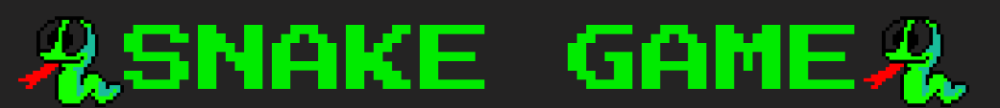

<div align="center">
    
</div>
<br>
<p align="center">
  
  
  
  
  
  
 
</p>

<h3>Tópicos</h3> 

:small_blue_diamond: [Descrição do projeto](#descrição-do-projeto)

:small_blue_diamond: [Funcionalidades](#funcionalidades)

:small_blue_diamond: [Deploy da Aplicação](#deploy)

:small_blue_diamond: [Pré-requisitos](#pré-requisitos)

:small_blue_diamond: [Como rodar a aplicação](#como-rodar-a-aplicação-arrow_forward)

<hr>

## Descrição do projeto 

<p align="justify">
  O clássico jogo da cobrinha ! 
  Só que feito em JS
  :snake:
  :video_game:  
</p>

<hr>

## Funcionalidades

:heavy_check_mark: Garantir diversão

:heavy_check_mark: Causar nostalgia

<hr>

## Deploy 
Layout/Deploy da Aplicação :zap:

> Link do deploy da aplicação: https://snakearcadegame.netlify.app/


<hr>

## Pré-requisitos 

:earth_americas: [Navegador WEB](https://www.google.com/intl/pt-BR/chrome/)

<hr>

## Como rodar a aplicação :arrow_forward:

No terminal, clone o projeto: 

```
git clone https://github.com/gknpp23/the_snake_game/
```
Com os arquivos em sua máquina basta abrir o arquivo <strong>index.html</strong> em seu navegador padrão.
<br><br>

<hr> 

## Resolvendo Problemas :exclamation:

### Erro :shit:
Quando o personagem atravessava de um lado para o outro, era possivel deslocá-lo no eixo oposto fazendo com que ele fosse reposicionado em locais inesperados.
<br>
<i>Ex:</i> Ao se atravessar do lado direito para o lado esquerdo, se fosse pressionado as teclas cima/baixo o personagem poderia sair no lado superior/inferior.

### Solução :heavy_check_mark:
Adicionei uma verificação na função responsável pela leitura das teclas. A cada vez que uma tecla era pressionada era feita uma checagem se o personagem estava na bordas do eixo oposto. Caso atendesse essa condição era desabilitado as teclas senão o movimento era atribuido normalmente.
<br>
<i>Ex:</i> Caso fosse pressionado a tecla UP e se o movimento atual não fosse contrário (DOWN) seria verificado se o personagem não se encontra nos limites do eixo X. Se o personagem estivesse nessa posição seria encerrada a função ao contrário o personagem seria movido para cima.
<br>


## Tarefas em aberto

:memo: Possibilidade de zerar o high_score.

<hr>

## Licença 

The [MIT License]() (MIT)

Copyright :copyright: 2022 - The Snake Game

<hr>

<h2 align="center"> Desenvolvido com :hearts: por Gabriel Knupp</h2>
